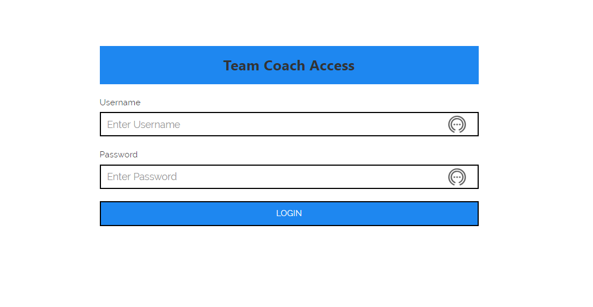
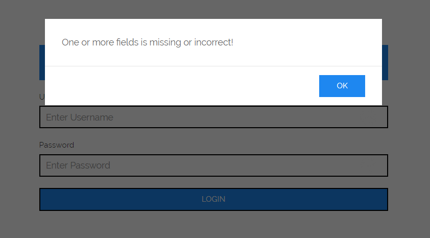
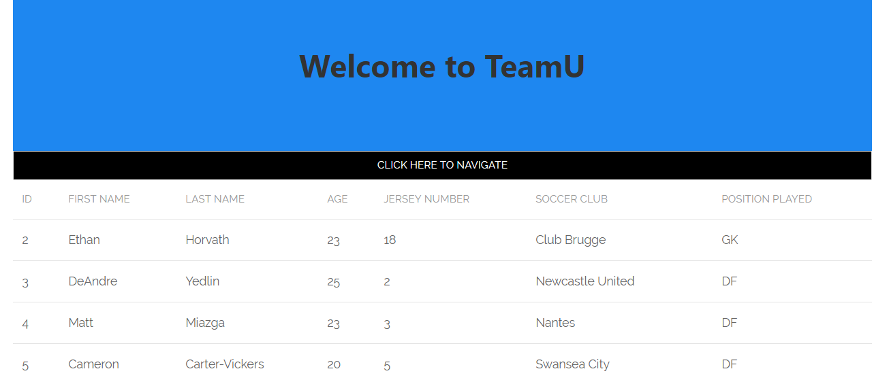
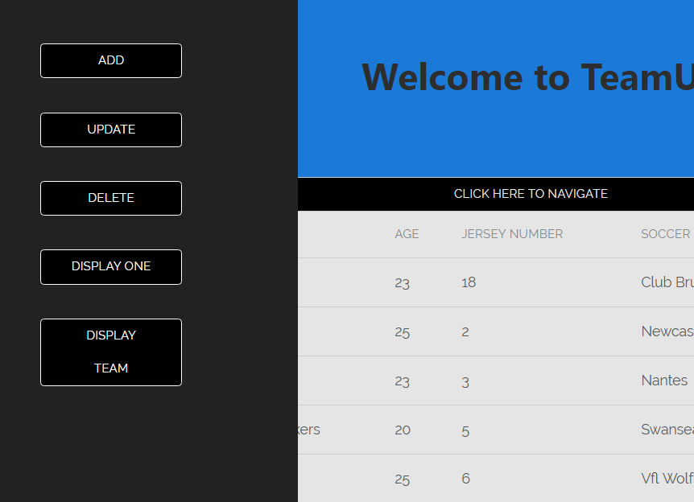
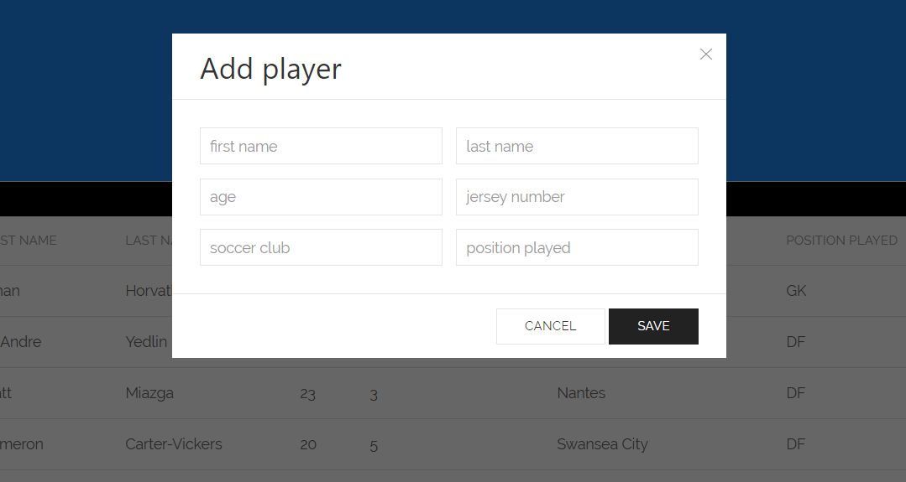

# The-Team

## Using The-Team

This is a team management app.

The user starts by opening the index page. This contains the login. The correct credentials (temporarily it is: Admin & Team, respectively) will grant the user access otherwise an alert or warning will pop up.

The alert looks like the following image

The main page upon login poulates a table with data from a database with information about soccer players in the U.S. national team. The image is below.

The table has a black button navigation button. Click here to manipulate the table either by adding, deleting, updating or displaying a player.

All the nav buttons excepting the last one will produce a pop up that will require information input for any changes to be made to the table. For example, the add button will produce the following:

The rest of the process is self-explanantory and the app can easily be adapted to any other kind of use requiring management of visual data.
